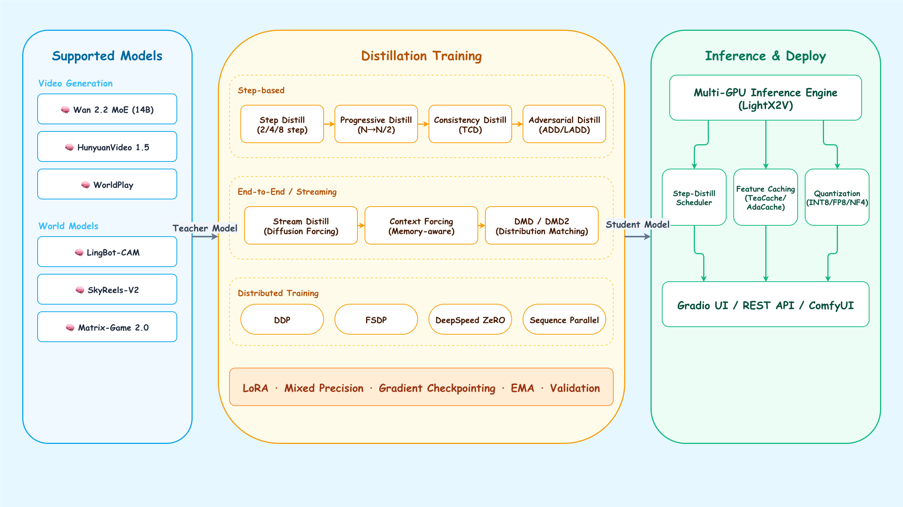

<div align="center">


# WorldDistill

**A unified toolkit for distilling and accelerating video generation models and world models.**

[](LICENSE)
[](https://python.org)
[](https://pytorch.org)

</div>

---

## Overview

WorldDistill provides a **unified framework** for distilling video generation models and interactive world models into faster, smaller variants. It integrates:

- **Inference Engine** — High-performance multi-GPU inference with step distillation, adapted from [LightX2V](https://github.com/ModelTC/lightx2v)
- **Training Pipeline** — Multiple distillation methods (step, stream, progressive, consistency, context forcing, adversarial ADD/LADD, DMD), referencing [Open-Sora](https://github.com/hpcaitech/Open-Sora) and [HY-WorldPlay](https://github.com/Tencent/HunyuanVideo)
- **Distributed/Acceleration** — DDP/FSDP/DeepSpeed (ZeRO), Sequence Parallelism, gradient checkpointing, mixed precision
- **Extensible Architecture** — Registry-based Runner/Scheduler system for easy model integration

### Architecture

<div align="center">

</div>

---

## Supported Models

### Video Generation Models

| Model | Architecture | Tasks | Distillation Methods | Status |
|:------|:------------|:------|:-------------------|:------:|
| **Wan 2.1 / 2.2** | Wan DiT | T2V, I2V | Step, LoRA, Full, FP8 | ✅ |
| **Wan 2.2 MoE (A14B)** | Wan MoE DiT | T2V, I2V | Step (4-step, dual model) | ✅ |
| **HunyuanVideo 1.5** | HY DiT | T2V, I2V | Step | ✅ |
| **SkyReels-V2** | Wan + Diffusion Forcing | T2V, I2V | Stream (Diffusion Forcing) | 🔧 |

### World Models (Interactive / Game Generation)

| Model | Architecture | Tasks | Distillation Methods | Status |
|:------|:------------|:------|:-------------------|:------:|
| **WorldPlay** | HY DiT + Action + PRoPE | T2V, I2V, Game | Step, Context Forcing | ✅ |
| **LingBot-CAM** | Wan MoE + Plucker Camera | I2V (Camera Ctrl) | — | ✅ |
| **GameFactory** | Custom | Game Video | Step | 🔧 |
| **Hunyuan-GameCraft** | HY DiT | Game Video | Step, Context Forcing | 🔧 |
| **Infinite-World** | Custom | Open-World Game | Step | 🔧 |
| **Matrix-Game 2.0** | Wan + Self-Forcing | Game | Step | 🔧 |
| **Genie / Genie 2** | Autoregressive | Game | Progressive | 🔧 |
| **GameGen-X** | Custom | Game | Step | 🔧 |
| **V-Mem / SPMem** | Memory-augmented | Long Video | Context Forcing | 🔧 |
| **CAM** | Memory-augmented | Long Video | Context Forcing | 🔧 |
| **Mirage (Decart)** | Custom | Game | Step | 🔧 |

> ✅ = Fully supported &nbsp;|&nbsp; 🔧 = Runner interface defined, implementation in progress — contributions welcome!

---

## Distillation Methods

| Method | Target Steps | Key Idea | Config Preset |
|:-------|:----------:|:---------|:-------------|
| **Step Distillation** | 2 / 4 / 8 | Fixed timestep schedule, no CFG. Supports MoE dual-model (high/low noise). | `step_distill_4step.json` |
| **Stream Distillation** | Per-frame | Diffusion Forcing: per-frame independent noise with monotonic schedule. Sliding window for infinite length. | `stream_distill.json` |
| **Progressive Distillation** | N → N/2 | Iteratively halve steps: teacher does 2 steps, student matches in 1. | — |
| **Consistency Distillation** | 1–4 | Trajectory Consistency (TCD). EMA target + Huber loss for stability. | `consistency_distill.json` |
| **Context Forcing** | 4 | Memory-aware: teacher-generated context prevents student drift. Curriculum training. | `context_forcing.json` |
| **Adversarial Distillation (ADD/LADD)** | 1–4 | Score distillation + adversarial discriminator in latent space. | — |
| **Distribution Matching Distillation (DMD)** | 1 | Fake score network aligns student distribution with teacher. | — |
| **Distribution Matching Distillation (DMD2)** | 1 | GAN-augmented distillation on real data (no fake-score regression). | — |

---

## Feature Checklist (功能清单)

- **Training Pipeline**: unified trainer loop, gradient accumulation, EMA, checkpointing, resume.
- **Distillation Methods**: Step, Stream (Diffusion Forcing), Progressive, Consistency (TCD), Context Forcing, Adversarial (ADD/LADD), DMD.
- **Distributed/Acceleration**: DDP, FSDP (FULL/HYBRID), DeepSpeed ZeRO (1/2/3), Sequence Parallelism, mixed precision, gradient checkpointing.
- **Inference Engine**: LightX2V-based multi-GPU inference, step-distill schedulers, stream/consistency schedulers.
- **Data & Sampling**: cached latent dataset, bucket sampler for variable resolution/frames.
- **Utilities**: model downloader, fast sync, weight conversion, camera pose generator.
- **Logging**: console logging with optional WandB.
- **Evaluation**: periodic validation via `val_data_json` and `eval_every`.

## Quick Start

### 1. Environment Setup

```bash
# Clone & install
git clone https://github.com/your-org/WorldDistill.git
cd WorldDistill
bash scripts/setup_env.sh
```

Or manually:

```bash
conda create -n worlddistill python=3.10 -y && conda activate worlddistill
pip install torch==2.5.1 --index-url https://download.pytorch.org/whl/cu121
pip install flash-attn --no-build-isolation
cd inference && pip install -e . && cd ..
pip install -r requirements.txt
```

### 2. Download Models

```bash
# Configure credentials (if behind proxy)
cp .env.example .env
# Edit .env with your proxy/HF token settings

# List available models
python tools/download_models.py --list

# Download a specific model
python tools/download_models.py --model wan2.2_moe --target-root ./models
```

### 3. Inference

**Single GPU:**

```bash
python -m lightx2v.infer \
    --model_cls wan2.2_moe \
    --task t2v \
    --model_path ./models/Wan2.2-T2V-A14B \
    --prompt "A white cat wearing sunglasses on a surfboard at a summer beach."
```

**Multi-GPU (8×H20):**

```bash
bash scripts/run_infer.sh \
    --model wan2.2_moe \
    --task t2v \
    --prompt "A futuristic cityscape at sunset with flying cars." \
    --gpus 8
```

**Step-distilled (4-step, 8× faster):**

```bash
bash scripts/run_infer.sh \
    --model wan2.2_moe_distill \
    --task t2v \
    --prompt "An astronaut floating in space, Earth in the background." \
    --gpus 8
```

### 4. Distillation Training

**Step Distillation (4-step):**

```bash
torchrun --nproc_per_node=8 training/train_distill.py \
    --distill_method step_distill \
    --teacher_model_path ./models/Wan2.2-T2V-A14B \
    --model_cls wan2.2_moe \
    --distill_preset configs/distill_presets/step_distill_4step.json \
    --data_json data/train.json \
    --cache_dir data/cached_latents \
    --output_dir results/step_distill_4step \
    --learning_rate 1e-5 \
    --max_train_steps 50000 \
    --batch_size 1
```

**Stream Distillation (Diffusion Forcing):**

```bash
torchrun --nproc_per_node=8 training/train_distill.py \
    --distill_method stream_distill \
    --teacher_model_path ./models/SkyReels-V2 \
    --model_cls skyreels_v2 \
    --distill_preset configs/distill_presets/stream_distill.json \
    --data_json data/train.json \
    --output_dir results/stream_distill
```

**Context Forcing (for world models):**

```bash
torchrun --nproc_per_node=8 training/train_distill.py \
    --distill_method context_forcing \
    --teacher_model_path ./models/HunyuanVideo-WorldPlay \
    --model_cls worldplay \
    --distill_preset configs/distill_presets/context_forcing.json \
    --data_json data/train.json \
    --optimizer muon \
    --output_dir results/context_forcing
```

**Adversarial Distillation (ADD/LADD):**

```bash
torchrun --nproc_per_node=8 training/train_distill.py \
    --distill_method adversarial_distill \
    --teacher_model_path ./models/Wan2.2-T2V-A14B \
    --model_cls wan2.2_moe \
    --data_json data/train.json \
    --output_dir results/adversarial_distill
```

**DMD (Distribution Matching Distillation):**

```bash
torchrun --nproc_per_node=8 training/train_distill.py \
    --distill_method dmd_distill \
    --teacher_model_path ./models/Wan2.2-T2V-A14B \
    --model_cls wan2.2_moe \
    --data_json data/train.json \
    --output_dir results/dmd_distill
```

**DMD2 (GAN-augmented):**

```bash
torchrun --nproc_per_node=8 training/train_distill.py \
    --distill_method dmd_distill \
    --dmd_variant dmd2 --dmd_use_gan \
    --teacher_model_path ./models/Wan2.2-T2V-A14B \
    --model_cls wan2.2_moe \
    --data_json data/train.json \
    --output_dir results/dmd2_distill
```

**With LoRA (parameter-efficient):**

```bash
torchrun --nproc_per_node=8 training/train_distill.py \
    --distill_method step_distill \
    --teacher_model_path ./models/Wan2.2-T2V-A14B \
    --use_lora --lora_rank 64 \
    --distill_preset configs/distill_presets/step_distill_4step.json \
    --data_json data/train.json \
    --output_dir results/step_distill_lora
```

### Parallel Training Options

- **DDP**: `--parallel_mode ddp` (default)
- **FSDP**: `--parallel_mode fsdp --fsdp_shard_strategy full|hybrid`
- **DeepSpeed ZeRO**: `--parallel_mode deepspeed --deepspeed_stage 1|2|3`
- **Sequence Parallel**: `--sp_size 2` (set group size, combine with any mode)

### Validation / Evaluation

```bash
torchrun --nproc_per_node=8 training/train_distill.py \
    --distill_method step_distill \
    --teacher_model_path ./models/Wan2.2-T2V-A14B \
    --data_json data/train.json \
    --val_data_json data/val.json \
    --eval_every 5000 \
    --eval_batches 4
```

### 5. Benchmarking

```bash
# Wan2.2 MoE T2V benchmark (5 prompts, 8 GPUs)
bash scripts/benchmarks/bench_wan22.sh

# LingBot camera-controlled I2V benchmark
bash scripts/benchmarks/bench_lingbot.sh

# HunyuanVideo 1.5 T2V benchmark
bash scripts/benchmarks/bench_hunyuan.sh
```

---

## Project Structure

```
WorldDistill/
├── inference/                  # Inference engine (adapted from LightX2V)
│   ├── lightx2v/
│   │   ├── infer.py            # Inference entry point
│   │   ├── models/
│   │   │   ├── runners/        # Model-specific runners
│   │   │   │   ├── wan/        # Wan 2.1/2.2/MoE runners
│   │   │   │   ├── hunyuan_video/ 
│   │   │   │   ├── worldplay/  # WorldPlay runner
│   │   │   │   └── world_models/  # World model stubs (10 models)
│   │   │   └── schedulers/
│   │   │       ├── wan/step_distill/        # Step distillation scheduler
│   │   │       ├── stream_distill/          # Stream (Diffusion Forcing) scheduler
│   │   │       └── consistency_distill/     # Consistency (TCD) scheduler
│   │   └── utils/
│   └── configs/                # Model-specific inference configs
│
├── training/                   # Distillation training pipeline
│   ├── train_distill.py        # Training entry point
│   ├── trainer_args.py         # All configurable hyperparameters
│   ├── trainers/
│   │   ├── base_distill_trainer.py      # Base class (flow matching, DDP/FSDP/DS, grad accum)
│   │   ├── step_distill_trainer.py      # Fixed N-step + dual-model MoE
│   │   ├── stream_distill_trainer.py    # Diffusion Forcing + sliding window
│   │   ├── progressive_distill_trainer.py # Iterative step halving
│   │   ├── consistency_distill_trainer.py # TCD/LCD + EMA
│   │   ├── context_forcing_trainer.py   # Memory-aware + curriculum
│   │   ├── adversarial_distill_trainer.py # ADD/LADD adversarial distillation
│   │   └── dmd_distill_trainer.py       # Distribution Matching Distillation (DMD/DMD2)
│   ├── data/
│   │   ├── video_dataset.py    # Raw video + cached latent datasets
│   │   └── bucket_sampler.py   # Resolution/frame bucketed sampling
│   └── utils/
│       ├── optimizers.py       # AdamW + Muon optimizer
│       ├── schedulers.py       # LR schedulers (cosine, linear, etc.)
│       └── distributed.py      # DDP + FSDP + DeepSpeed utilities
│
├── tools/                      # Utility scripts
│   ├── download_models.py      # Model downloader (HuggingFace)
│   ├── fast_sync.py            # High-speed parallel file sync
│   ├── generate_camera_poses.py # Camera trajectory generator
│   └── convert_weights.py      # Weight format converter
│
├── scripts/                    # Shell scripts
│   ├── setup_env.sh            # Environment setup
│   ├── run_infer.sh            # Unified inference runner
│   ├── run_train.sh            # Unified training runner
│   └── benchmarks/             # Model-specific benchmark scripts
│
├── configs/
│   ├── model_zoo.yaml          # Model registry (architectures, tasks, papers)
│   └── distill_presets/        # Distillation method presets (JSON)
│
├── pics/                       # Project images
│   ├── worldDistill_banner.jpg # Project banner
│   └── FlowChart.png           # Architecture flowchart
│
├── .env.example                # Environment variable template
├── requirements.txt            # Python dependencies
├── setup.py                    # pip install -e .
└── LICENSE                     # Apache 2.0
```

---

## Data Preparation

WorldDistill supports two data modes:

### Cached Latent Mode (Recommended)

Pre-compute latents and text embeddings for faster training:

```json
[
  {
    "latent_path": "latents/video_001.pt",
    "text_embed_path": "text_embeds/video_001.pt",
    "image_cond_path": "image_conds/video_001.pt",
    "num_frames": 49,
    "resolution": [60, 107],
    "text": "A cat playing with a ball..."
  }
]
```

### Raw Video Mode

Load and encode videos on-the-fly (slower, but requires no preprocessing):

```json
[
  {
    "path": "videos/video_001.mp4",
    "text": "A cat playing with a ball...",
    "resolution": [480, 854],
    "num_frames": 49,
    "fps": 24
  }
]
```

---

## Adding a New Model

WorldDistill uses a **registry-based** Runner system. To add a new model:

1. **Create a Runner** in `inference/lightx2v/models/runners/your_model/`:

```python
from lightx2v.utils.registry_factory import RUNNER_REGISTER
from lightx2v.models.runners.default_runner import DefaultRunner

@RUNNER_REGISTER("your_model_key")
class YourModelRunner(DefaultRunner):
    def __init__(self, config):
        super().__init__(config)
        # Load your model architecture
    
    def run(self, *args, **kwargs):
        # Implement inference pipeline
        ...
```

2. **Register** in `inference/lightx2v/infer.py` — add `"your_model_key"` to the `model_cls` choices list and import.

3. **Add config** in `inference/configs/your_model/` and register in `configs/model_zoo.yaml`.

4. **(Optional)** Add a custom Scheduler in `inference/lightx2v/models/schedulers/` for specialized distillation.

---

## Adding a New Distillation Method

1. **Create a Trainer** in `training/trainers/your_method_trainer.py`:

```python
from training.trainers.base_distill_trainer import BaseDistillTrainer

class YourMethodTrainer(BaseDistillTrainer):
    def compute_distill_loss(self, teacher_output, student_output, batch, timesteps):
        # Define your loss function
        ...
    
    def prepare_teacher_input(self, batch, noisy_latents, timesteps):
        # Prepare model inputs
        ...
```

2. **Register** in `training/trainers/__init__.py`:

```python
from training.trainers.your_method_trainer import YourMethodTrainer
TRAINER_REGISTRY["your_method"] = YourMethodTrainer
```

3. **Add preset** in `configs/distill_presets/your_method.json`.

---

## Known Limitations

- **Runner-based training**: Training-side Runner integration is a placeholder; use diffusers or explicit weight files.
- **FSDP checkpoints**: Optimizer state is not fully captured in FSDP saves (model weights only).
- **Unused args**: `denoising_steps_per_frame`, `generator_update_interval`, and `loss_type` are currently not wired into training loops.

## Acknowledgments

- [LightX2V](https://github.com/ModelTC/lightx2v) — Inference acceleration framework (basis of our inference engine)
- [Open-Sora 2.0](https://github.com/hpcaitech/Open-Sora) — Training infrastructure (flow matching, bucket sampling)
- [HY-WorldPlay](https://github.com/Tencent/HunyuanVideo) — World model training pipeline (context forcing, Muon optimizer, curriculum)
- [SkyReels-V2](https://github.com/SkyworkAI/SkyReels-V2) — Diffusion Forcing reference
- [Adversarial Diffusion Distillation](https://arxiv.org/abs/2311.17042) — ADD/LADD distillation
- [Latent Adversarial Diffusion Distillation](https://arxiv.org/abs/2403.12015) — latent-space adversarial distillation
- [Distribution Matching Distillation](https://arxiv.org/abs/2311.18828) — DMD
- [Improved DMD](https://arxiv.org/abs/2405.14867) — DMD2
- [Consistency Models](https://arxiv.org/abs/2303.01469) — Trajectory consistency distillation

---

## Citation

If you find WorldDistill useful, please consider citing:

```bibtex
@misc{worlddistill2025,
  title={WorldDistill: A Unified Toolkit for Video Generation Model Distillation},
  year={2025},
  url={https://github.com/your-org/WorldDistill}
}
```

## License

[Apache License 2.0](LICENSE)
