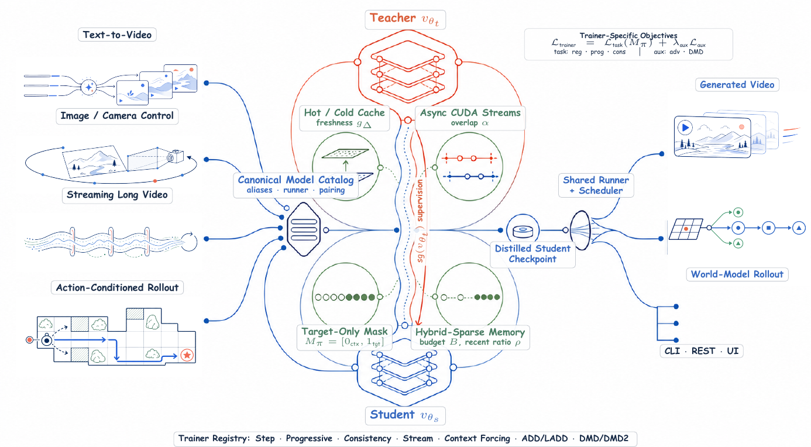
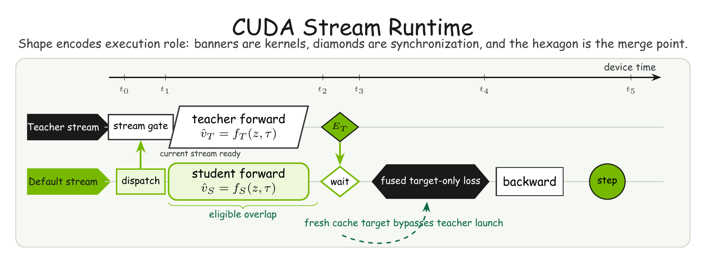
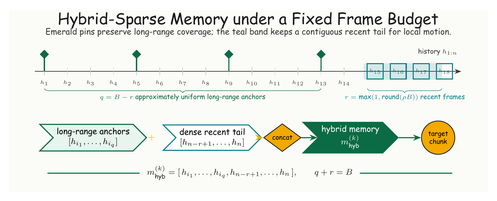
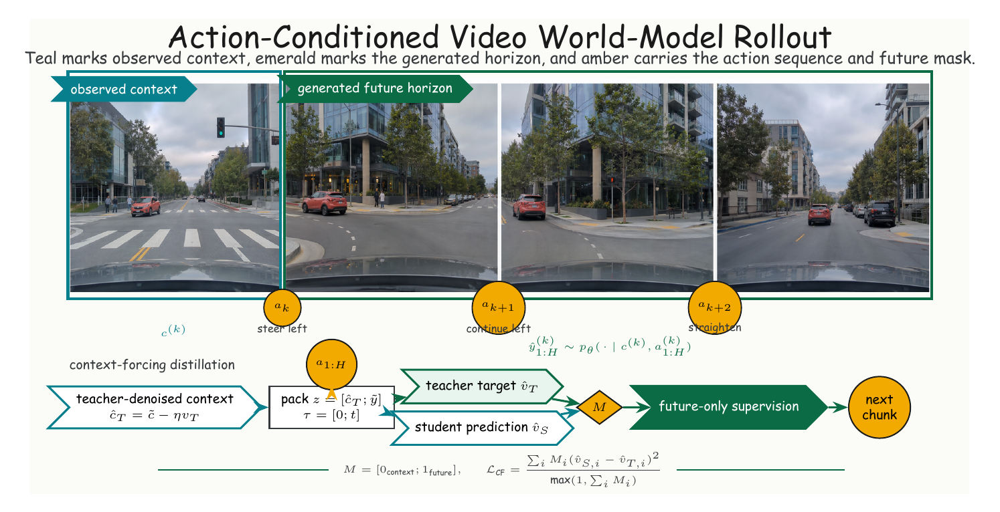

<div align="center">

# WorldDistill

**A unified distillation runtime for video generators and world models.**

[](https://github.com/Sunbeam23333/WorldDistill/actions/workflows/ci.yml)
[](https://www.python.org/)
[](https://pytorch.org/)
[](LICENSE)

[Installation](docs/installation.md) · [Inference](docs/inference.md) · [Training](docs/training.md) · [Model support](docs/model-support.md) · [CUDA policy](docs/cuda-compatibility.md) · [Implementation audit](docs/implementation-audit.md)

</div>

WorldDistill couples a research-oriented training/runtime layer for video and
action-conditioned world models with a vendored, LightX2V-based multimodal
inference backend. The repository contains executable trainer loops, cache and
memory policies, CUDA-stream primitives, model/config metadata, and inference
runners. Image and audio-video support currently belongs primarily to the
inference backend; it is not presented as end-to-end distillation training.

> **Evidence boundary.** CPU tests validate interfaces, cache/memory semantics,
> all seven trainer loops, real tiny Diffusers denoisers, trained-student export/reload,
> and exact save/resume (including two-process CPU/Gloo). CUDA
> policies are implemented and simulated for A100, H20, B200, and B300 profiles,
> but this repository does not yet contain measured hardware run records for those
> GPUs. “Integrated” below never means “benchmark-validated.”

## Architecture

<div align="center">
  
</div>

The bow-tie view separates task inputs, teacher/student execution, runtime
mechanisms, and deployment outputs. The trainer registry includes Step,
Progressive, Consistency, Stream, Context Forcing, adversarial, and DMD-style
research paths; their maturity is stated explicitly below rather than collapsed
into one support checkmark. [Figure provenance](assets/readme/PROVENANCE.md).

## What is implemented

| Component | Repository state | Validation in this repository |
|---|---|---|
| Shared model metadata | YAML registry plus train/infer resolvers and aliases | CPU catalog/config consistency tests |
| Step distillation | Fixed-timestep trainer, target-only supervision, checkpoint-native dual teacher/student experts | Real tiny Wan forward/backward and exact export/reload; pretrained-model validation pending |
| Stream / Progressive / Consistency | Generated-overlap multi-step unroll, complete progressive intervals, EMA consistency | CPU optimizer/restart tests; real tiny Wan tests where its forward contract supports the method |
| Context Forcing | Teacher context, target mask, frame-aligned action/camera packing, tail-safe chunking | CPU memory, temporal-index, and non-divisible-tail tests |
| Hybrid-Sparse Memory | Full-history sparse anchors plus contiguous recent tail | Deterministic selector tests |
| DistillCache | Memory/disk/hybrid stores; original-age-preserving promotion; bounded background CPU prefetch | CPU freshness, worker and runtime regressions |
| CUDA stream runtime | Independent teacher stream, event recording, explicit wait | CPU fallback tests; GPU profiler evidence pending |
| Dense attention fallback | Device-aware FA2/FA3/Sage/SDPA selection after config overlays | Simulated A100/H20/B200/B300 dispatch tests |
| Fused target-only MSE | Triton kernel with PyTorch reference path | CPU numerical reference test; CUDA JIT test pending |
| DDP / FSDP / DeepSpeed | Wrapper and collective checkpoint control flow | Actual two-process CPU/Gloo train/resume tests; multi-rank GPU restart test pending |
| Adversarial / DMD-style paths | Latent discriminator; fake-distribution DSM and detached teacher-minus-fake generator gradients | Tiny-model updates and numerical contracts; pretrained quality/paper-reproduction validation pending |

## Core mechanisms

### CUDA stream runtime

<div align="center">
  
</div>

The teacher may launch on a dedicated CUDA stream while the student advances on
the default stream. An event establishes the supervision dependency before the
loss. Diagram spacing is schematic, not a measured profiler trace.
[PDF](assets/readme/cuda_stream_runtime.pdf) · [TeX source](assets/readme/source/cuda_stream_runtime.tex)

### Hybrid-Sparse Memory

<div align="center">
  
</div>

Under budget `B`, the selector keeps `r = max(1, round(rho * B))` recent frames
contiguously and samples the remaining anchors across the complete earlier
history. Teacher-generated and ground-truth context now consume the same selected
indices. [PDF](assets/readme/hybrid_sparse_memory.pdf) · [TeX source](assets/readme/source/hybrid_sparse_memory.tex)

### Action-conditioned context forcing

<div align="center">
  
</div>

The lower panel reflects the implemented training dataflow: teacher-denoised
context, packed context/target timesteps, action conditioning, and future-only
supervision. The street frames are a generated schematic visualization, not
released-checkpoint output or rollout benchmark evidence.
[PDF](assets/readme/action_conditioned_rollout.pdf) · [TeX source](assets/readme/source/action_conditioned_rollout.tex)

## Quick verification

Create and activate a Python 3.10–3.12 environment, install a PyTorch build for
your target GPU from the [official selector](https://pytorch.org/get-started/locally/),
then install WorldDistill:

```bash
git clone https://github.com/Sunbeam23333/WorldDistill.git
cd WorldDistill
bash scripts/setup_env.sh --dev

python tools/check_cuda_compat.py --json
python -m pytest -q training/tests
```

Optimized kernels and DeepSpeed are opt-in because their builds are tied to the
active CUDA/PyTorch environment:

```bash
bash scripts/setup_env.sh --install-kernels --install-deepspeed
python tools/check_cuda_compat.py --strict
```

See [installation and hardware notes](docs/installation.md) before using
Blackwell. A CUDA version table is a compatibility policy, not a substitute for
an actual kernel forward/backward run on the target host.

## Inference CLI

Resolve configs and validate shell quoting without loading a checkpoint:

```bash
bash scripts/run_infer.sh \
  --model_cls wan2.2_moe \
  --task t2v \
  --model_path ./models/Wan2.2-T2V-A14B \
  --prompt "A paper boat crossing a rain-soaked city street." \
  --gpus 1 \
  --dry-run
```

Run after the dry-run command and CUDA probe are correct:

```bash
bash scripts/run_infer.sh \
  --model_cls wan2.2_moe \
  --task t2v \
  --model_path ./models/Wan2.2-T2V-A14B \
  --prompt "A paper boat crossing a rain-soaked city street." \
  --gpus 1
```

The default JSON above is serial. The wrapper now rejects a mismatched
`--gpus` value instead of launching independent workers on one device. For
multi-GPU inference, pass a config whose `parallel` mesh has the same world
size. Dry-run checks command/config/topology construction only; it does not
check that input files or checkpoints exist and does not execute a kernel.

Conditioned tasks require their actual inputs. For example:

```bash
# Speech-to-video
bash scripts/run_infer.sh --model_cls seko_talk --task s2v \
  --model_path ./models/SekoTalk --image_path /path/to/portrait.png \
  --audio_path /path/to/speech.wav --prompt "The speaker addresses the camera." \
  --gpus 1 --dry-run

# Image editing
bash scripts/run_infer.sh --model_cls qwen_image --task i2i \
  --model_path ./models/Qwen-Image-Edit --image_path /path/to/input.png \
  --prompt "Render the scene as a watercolor." --gpus 1 --dry-run

# Action-conditioned world model
export LIGHTX2V_WORLDPLAY_POSE_PROVIDER=your_package.worldplay_pose_adapter
bash scripts/run_infer.sh --model_cls worldplay_distill --task game \
  --model_path ./models/HY-WorldPlay --image_path /path/to/start.png \
  --prompt "Drive through the intersection while keeping the scene coherent." \
  --pose "w-3, right-0.5" --action_ckpt ./models/HY-WorldPlay/action.safetensors \
  --gpus 1 --dry-run
```

The wrapper validates required argument presence and also forwards
`last_frame_path`, `audio_path`, `image_strength`, VACE/Animate inputs,
camera/action files, and explicit output paths. See
[docs/inference.md](docs/inference.md).

## Distillation training

The fastest executable training check uses tiny CPU models and exercises forward,
backward, optimizer, checkpoint save, and resume:

```bash
python -m pytest -q training/tests/test_training_loop_smoke.py
```

The unified real-model entry accepts Diffusers-style directories whose
transformer forward contract matches the selected trainer:

```bash
torchrun --nproc_per_node=8 training/train_distill.py \
  --distill_method step_distill \
  --teacher_model_path ./models/teacher-diffusers \
  --model_cls wan2.2_moe \
  --data_json data/train_cached.json \
  --data_mode cached \
  --cache_dir data/cached_latents \
  --output_dir results/step_distill
```

Runner-native training adapters for every inference family are not complete.
Before a long run, execute a one-step forward/backward smoke test with the exact
checkpoint, config, CUDA build, and conditioning schema. Method maturity and
data schemas are documented in [docs/training.md](docs/training.md).

## Model integration status

“Runner + config” means concrete inference source and a default config are in the
repository. “CLI contract” means argument/config construction is CPU-tested.
Neither column asserts output quality or target-GPU validation.

| Family | Inference surface | Unified training | Notes |
|---|---|---|---|
| Wan 2.1 / 2.2, distilled, VACE, Animate, Self-Forcing | Runner + config | Experimental generic adapter | Several optimized kernels remain environment-specific |
| HunyuanVideo 1.5 | Runner + config | Experimental generic adapter | Transformer/config layout must match the checkpoint |
| HY-WorldPlay | Runner + config; external licensed pose adapter required | Context-forcing research path | Game CLI is contract-tested; closed-loop rollout metrics pending |
| Matrix-Game 2.0 | Runner + config; game CLI contract | Not integrated | Image-conditioned game routing is wired |
| LingBot-CAM | Runner + config | Not integrated | Checkpoint location is external to the catalog |
| Wan 2.2 Audio | S2V runner + public config; CLI contract | Not integrated | Requires image and audio inputs |
| SekoTalk | S2V runner; stateful shot-based RS2V wrapper | Not integrated | RS2V reuses overlap latents across clips |
| LTX-Video 2 | Runner + config | Not integrated | Video/audio-video inference surface |
| Qwen Image / LongCat / Z-Image / BAGEL | Runner + config; image CLI contract | Not integrated | Inference only in WorldDistill today |
| SkyReels-V2 and nine catalogued world-model families | Stub/interface only | Not integrated | Ten stub families in total; contributions require a concrete runner, config, and smoke evidence |

The detailed per-model/task table and checkpoint availability are in
[docs/model-support.md](docs/model-support.md). The downloader intentionally does
not imply that every catalog entry has a downloadable checkpoint.

## CUDA compatibility policy

| Target | Compute capability | Native-toolchain policy | Preferred dense attention order |
|---|---:|---:|---|
| A100 | 8.0 | CUDA 11.0+ | FA2 → Sage2 → Torch SDPA |
| H100 / H200 | 9.0 | CUDA 11.8+ | FA3 → FA2 → Sage2 → Torch SDPA |
| H20 | 9.0 | CUDA 12.2+ | FA2 → Sage2 → Torch SDPA; FA3 requires device evidence |
| B200 | 10.0 | CUDA 12.8+ | Torch SDPA; optimized backend requires device evidence |
| B300 | 10.3 | CUDA 12.9+ policy; newer vendor builds recommended | Torch SDPA; optimized backend requires device evidence |

Resolution happens after JSON and checkpoint config overlays. Only dense backend
fields are changed; sparse/distributed algorithms such as Ulysses, ring, SVG,
and neighborhood attention are preserved. B200/B300 deliberately do not
auto-select the currently imported FA2/FA3/Sage3 callables: those public kernel
surfaces do not establish `sm_100`/`sm_103` compatibility. A strict probe also checks whether
PyTorch lists the native `sm_*` target instead of silently treating PTX JIT as
native validation. The vendored low-bit CUTLASS extension is explicitly
`sm_120a`-only and is not presented as B200/B300 support. More details:
[docs/cuda-compatibility.md](docs/cuda-compatibility.md).

## Known limitations

- No repository artifact yet proves end-to-end execution on A100, H20, B200, or
  B300. The current CUDA matrix is implemented policy plus simulated tests.
- Runner-native training is incomplete; most real-model training still depends
  on a compatible Diffusers transformer or an explicit adapter.
- Multi-rank FSDP/DeepSpeed now receive CPU-staged student parameters instead of
  an already materialized full GPU student. The teacher remains replicated;
  host RAM, GPU wrapping peaks and sharded GPU restart still need measurement.
- Bounded asynchronous cold-cache prefetch is implemented. Teacher-parameter
  offload across CPU/GPU remains a separate unimplemented executor.
- The adversarial and DMD-style trainers are research scaffolds, not certified
  formula-parity implementations of every ADD/LADD/DMD/DMD2 paper variant.
- Sequence-parallel helpers are adapter-gated. Generic models fail fast for
  `sp_size>1` because temporal slicing without model-layer communication is not
  a correct sequence-parallel attention implementation.
- Cached-latent manifests now fail fast on missing declared files and corrupt
  tensors. The repository still does not ship a universal preprocessing command
  for every model family.
- The top-level WorldDistill support matrix publishes no throughput, memory,
  quality, or “× faster” number without a checked-in run manifest and result
  artifact. The vendored LightX2V documentation retains clearly labelled
  upstream benchmark claims that WorldDistill has not reproduced.

See [docs/reproducibility.md](docs/reproducibility.md) for the evidence levels and
the GPU validation record expected before upgrading any claim. The release
[implementation audit](docs/implementation-audit.md) records fixed contracts and
the remaining gates. The [operator/training follow-up](docs/operator-training-audit.md)
documents the latest fixes, executable checks, and deliberately unclaimed capabilities.

## Repository map

```text
WorldDistill/
├── configs/                 model registry and distillation presets
├── inference/lightx2v/      vendored multimodal inference backend and runners
├── training/                trainers, runtime, data, distributed utilities, tests
├── scripts/                 setup, inference, training, and paper-suite wrappers
├── tools/                   compatibility probe, downloader, sync, conversion tools
├── assets/readme/           current figures, vector PDFs, TeX sources, provenance
└── docs/                    installation, support, CUDA, training, reproducibility
```

## Contributing

New integrations should include a real runner (not a stub), a default config,
input-contract tests, and an evidence record for every hardware claim. See
[CONTRIBUTING.md](CONTRIBUTING.md).

## Acknowledgments

- [LightX2V](https://github.com/ModelTC/LightX2V) — inference backend foundation
- [Open-Sora](https://github.com/hpcaitech/Open-Sora) — training infrastructure reference
- [HY-WorldPlay](https://github.com/Tencent-Hunyuan/HY-WorldPlay) — world-model/context-forcing reference
- [SkyReels-V2](https://github.com/SkyworkAI/SkyReels-V2) — diffusion-forcing reference

## Citation

```bibtex
@misc{worlddistill2026,
  title        = {WorldDistill: A Unified Distillation Runtime for Video Generators and World Models},
  year         = {2026},
  url          = {https://github.com/Sunbeam23333/WorldDistill}
}
```

## License

The code distributed in this repository is licensed under the
[Apache License 2.0](LICENSE), except where an individual file states otherwise.
WorldDistill does not bundle Tencent HY-WorldPlay source code or model weights;
its optional provider interface can load a user-supplied HY-WorldPlay
integration, which remains subject to Tencent's separate terms. Review
[THIRD_PARTY_NOTICES](THIRD_PARTY_NOTICES), the repository [NOTICE](NOTICE), and
the included [Tencent HY-WorldPlay Community License Agreement](third_party/licenses/TENCENT_HY_WORLDPLAY_COMMUNITY_LICENSE.txt)
before enabling or redistributing that optional integration.
